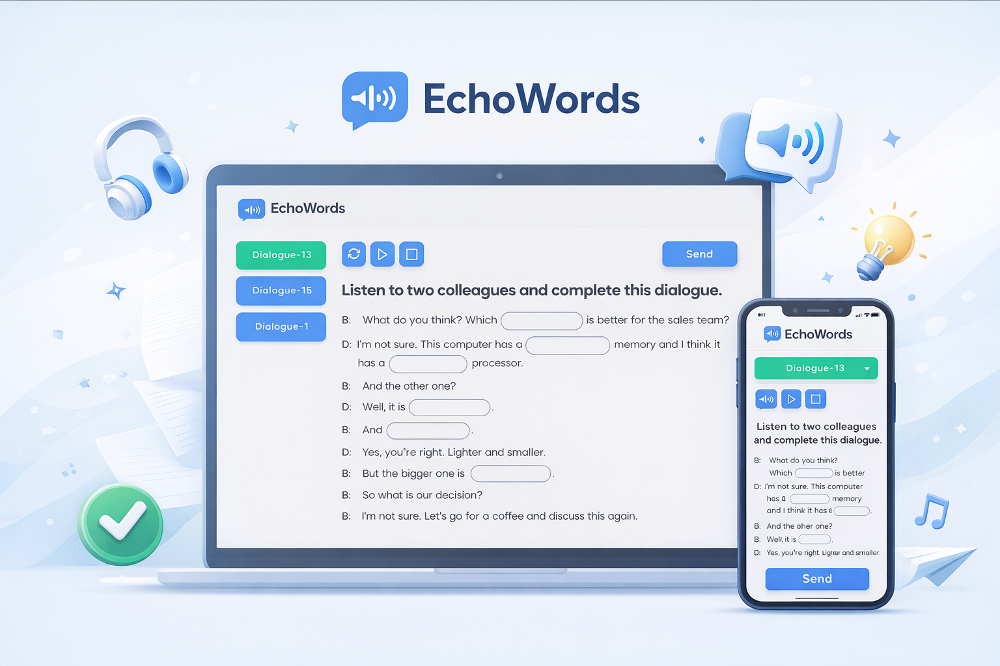

**Idioma:** 🇧🇷 Português |  [🇺🇸 English](./README.md) 

# EchoWords 🔊



EchoWords é uma aplicação web leve desenvolvida para ajudar estudantes de inglês a aprimorar sua **compreensão auditiva (listening)** por meio de exercícios interativos com áudio.

A plataforma apresenta diálogos em inglês onde algumas palavras são removidas do texto. O estudante deve ouvir o áudio com atenção e preencher as palavras faltantes com base no que foi compreendido.

Esse método estimula o treinamento ativo da escuta e ajuda o aluno a reconhecer melhor palavras e expressões em inglês falado.

---

## 📚 Contexto do Projeto

EchoWords foi criado originalmente em **2023**, durante aulas de inglês dentro de uma consultoria de software.

Como muitos dos clientes da empresa eram internacionais, os desenvolvedores participavam regularmente de aulas de inglês. Durante essas aulas, ficou evidente que a **compreensão auditiva** era uma das maiores dificuldades da equipe.

Com o objetivo de ajudar tanto a professora quanto os alunos, este projeto foi desenvolvido como uma ferramenta simples para praticar listening por meio de **exercícios de preenchimento de palavras a partir de diálogos em áudio**.

---

## 🎯 Objetivo de Aprendizagem

O EchoWords foi projetado para fortalecer uma das habilidades mais desafiadoras no aprendizado de um novo idioma:

**Compreensão auditiva (Listening).**

Ao utilizar a aplicação, os alunos podem:

* Melhorar a capacidade de entender inglês falado
* Reconhecer palavras e expressões em conversas reais
* Reforçar vocabulário através de contexto
* Praticar escuta ativa em vez de apenas ouvir passivamente
* Ganhar mais confiança ao interagir em inglês

---

## 🧠 Como Funciona

1. O estudante reproduz um áudio com um diálogo em inglês.
2. Um texto é exibido com **palavras faltando**.
3. O aluno deve digitar as palavras que acredita ter ouvido.
4. O sistema valida as respostas e auxilia no processo de aprendizado.

Esse formato de exercício é bastante utilizado em métodos de ensino de idiomas e ajuda a simular desafios reais de compreensão auditiva.

---

## ⚙️ Tecnologias Utilizadas

O projeto foi desenvolvido utilizando uma stack frontend moderna e simples:

* **Vite** – ferramenta rápida para desenvolvimento e build do projeto
* **Sass** – pré-processador CSS para organização e manutenção de estilos

```
devDependencies:
  sass: ^1.58.0
  vite: ^4.0.0
```

---

## 💡 Por que Treinar Listening é Importante?

A compreensão auditiva costuma ser uma das partes mais difíceis para estudantes de inglês, pois o idioma falado possui características como:

* Velocidade natural da fala
* Palavras conectadas
* Diferentes sotaques
* Ritmo e entonação naturais

O EchoWords ajuda os estudantes a se familiarizarem com essas características por meio de **exercícios focados em escuta ativa**.

---

## 🚀 Possíveis Melhorias Futuras

Algumas ideias para evoluções futuras do projeto:

* Sistema de pontuação para exercícios
* Diferentes níveis de dificuldade
* Suporte a múltiplos sotaques
* Interface para professores criarem exercícios
* Acompanhamento de progresso do aluno
* Geração automática de diálogos com IA

---

## 👨‍💻 Autor

Projeto desenvolvido por um jovem desenvolvedor durante aulas de inglês em um ambiente profissional, com o objetivo de apoiar professores e alunos no treinamento de habilidades de listening.
